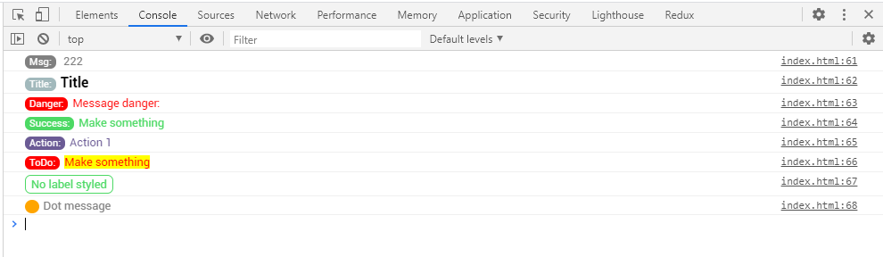
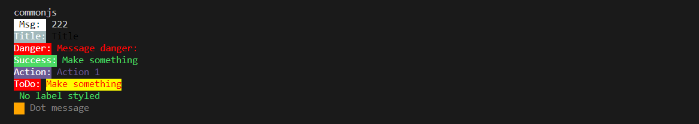

# Pretty Log
It is a simple logger for the Browser and Nodej. It is  a wrap off console.log to style it esier.

# Features:
* Keeps the line number of the code logged.
* Label styled
* Message styled
* Turn On and turn Off
* adder new styles
* same styling Browser and NodeJs

 


# Use it
### Project setup
```
npm i pretty-browser-log
```
### Use prettyLog in your project

**import module:**
```
import {prettyLog} from 'pretty-browser-log'
```
**use it on Browser:**

```
// where you want use 
    import {prettyLog} from 'pretty-browser-log'

    log.addManyLogStyles([
        {name:'title',badge:'Title:',badgeStyle:'',messageStyle:'color:black;font-size:1rem;font-weight:bold;'},
        {name:'danger',badge:'Danger:',badgeStyle:'background-color:red;',messageStyle:'color:red'},
        {name:'todo',badge:'ToDo:',badgeStyle:'background-color:red',messageStyle:'background-color:yellow;color:red;'},
        {name:'action',badge:'Action:',badgeStyle:'background-color:#6b5b95',messageStyle:'color:#6b5b95'},
        {name:'noLabel',badge:'',badgeStyle:'border: 0',messageStyle:'color:#4CD964; border: 1px solid;border-radius:0.4rem;padding:2px 6px'},
        {name:'dot',badge:'  ',badgeStyle:'background-color:orange ;border-radius:50%',messageStyle:''},
        {name:'success',badge:'Success:',badgeStyle:'background-color:#4CD964',messageStyle:'color:#4CD964;'},
        // {name:'',badge:'',badgeStyle:'',messageStyle:''},
    ])
export const log = prettyLog
...
```
```
// loaderPrettyLog.js In this file set the different style customizzable
    import {log} from './loaderPrettyLog.js'

    log.msg('222')
    log.title('Title')
    log.danger('Message danger:')
    log.success('Make something')
    log.action('Action 1')
    log.todo('Make something')
    log.noLabel('No label styled')
    log.dot('Dot message')

export const log = prettyLog
...
```
**use it in NodeJS:**

```
// where you want use 
const  {prettyLog: log}  = require('./index.js');

log.addManyLogStyles([
    {name:'title',badge:'Title:',badgeStyle:'',messageStyle:'color:black;font-size:1rem;font-weight:bold;'},
    {name:'danger',badge:'Danger:',badgeStyle:'background-color:red;',messageStyle:'color:red'},
    {name:'todo',badge:'ToDo:',badgeStyle:'background-color:red',messageStyle:'background-color:yellow;color:red;'},
    {name:'action',badge:'Action:',badgeStyle:'background-color:#6b5b95',messageStyle:'color:#6b5b95'},
    {name:'noLabel',badge:'',badgeStyle:'border: 0',messageStyle:'color:#4CD964; border: 1px solid;border-radius:0.4rem;padding:2px 6px'},
    {name:'dot',badge:'  ',badgeStyle:'background-color:orange ;border-radius:50%',messageStyle:''},
    {name:'success',badge:'Success:',badgeStyle:'background-color:#4CD964',messageStyle:'color:#4CD964;'},
    // {name:'',badge:'',badgeStyle:'',messageStyle:''},
])
module.exports = {log};
...
```


### PrettyLog methods

prettyLog.logON() set parameter prettyLog.debug to true and send a message 

prettyLog.logOFF() set parameter prettyLog.debug to false and send a message 

u can change too directly prettyLog.debug to true or false to show or not the logs.

